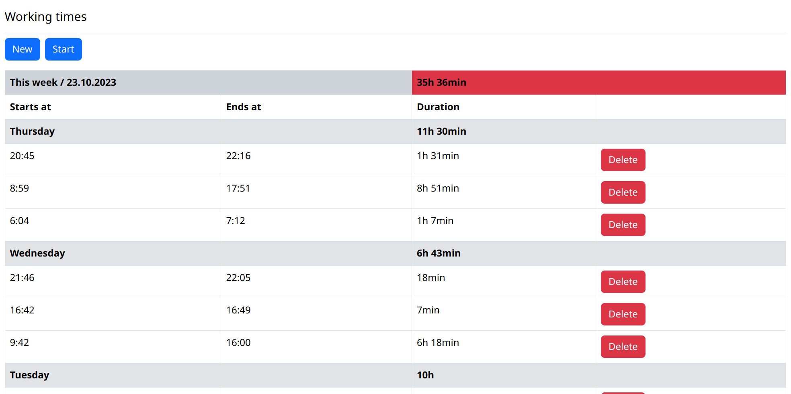

# README

This is a simple Rails application to track working times.
It displays a list of working times grouped by week and day and allows to add new ones with
start/end date or by simply starting & finishing a current working time.

---

